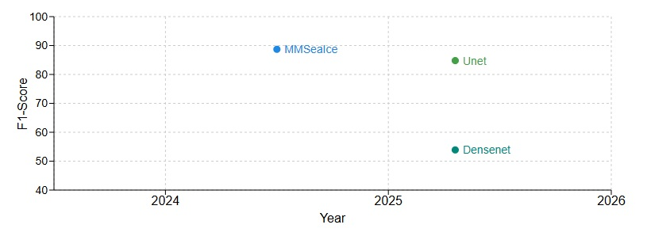

# Sea Ice Type Classification Leaderboard

## Repository Overview

Welcome to the **Sea Ice Type Classification Leaderboard**, where research meets competition, and the best models rise to the top! 🚀

This repository serves as the **official benchmark** for sea ice type classification models. Here, researchers, students, and industry professionals can submit their models, challenge existing baselines, and **contribute to advancing the state of the art** in sea ice classification.

 **Think you’ve built a better model?** This is the place to prove it! Submit your model, and let’s see where it stands among the best! 


[](https://github.com/bdlab-ucd/sea-ice-leaderboard) 
[](https://github.com/bdlab-ucd/IceBench/tree/main)
[](https://github.com/samiraat/Awesome-Sea-Ice-Papers)


## Current Leaderboard On AI4Arctic Sea Ice Challenge Dataset Challenge dataset


Here’s the current ranking of the top-performing models on the AI4Arctic Sea Ice Challenge Dataset:

|  Rank |  Model Name         |  Model Type |  Paper Venue    |  Code   |  Accuracy |  F1-Score | Precision |  Recall |  IoU  |
|------|----------------------|-------------|----------------|----------|-------------|---------|-----------|---------|------|
| 1    | MMSeaIce | UNet       | Cryosphere 2024 | [GitHub](https://github.com/echonax07/MMSeaIce) | N/A      | 88.7     | N/A       | N/A     | N/A  |
| 2    |  Unet       | UNet       |       | [GitHub](https://github.com/bdlab-ucd/IceBench) | 86.36    | 84.78   | 84.68     | 86.36  | 77.18 |
| 3    |  Densenet    | CNN      |    | [GitHub](https://github.com/bdlab-ucd/IceBench)  | 54.77     | 53.89   | 63.79     | 54.77   | 38.51  |


### Goals

- **Create a centralized leaderboard** for sea ice type classification models.
- **Encourage contributions** and comparisons of different models.
- **Provide baseline models** and easy access to pre-trained checkpoints.
- **Serve as a resource** for researchers working on sea ice classification.

## Why Participate?

### **Push the Boundaries of Sea Ice Research**
This leaderboard is not just about rankings; it’s about **discovering better solutions** for understanding and classifying sea ice types. Sea ice is critical to the global climate system, and **your contributions can make a difference**!

### **Access to Baseline Models**
Get started quickly with our **baseline models**, detailed documentation, and **pre-trained checkpoints**. Tweak them, experiment, and see if you can outperform the existing approaches!

### **Join a Community of Innovators**
Connect with like-minded researchers, contribute your findings, and **collaborate to push the field forward**.


## How to Participate

1. **Clone this Repository**:
   
   ```bash
   git clone git@github.com:bdlab-ucd/sea-ice-leaderboard.git
   cd sea-ice-benchmark-leaderboard


2. **Submit Your Model**:

   - Create a JSON file in the `submission/` folder with the following format:
   
     ```json
     {
     "model_name": "Your_Model_Name",
     "model_type": "Type_of_Model (e.g., CNN, Transformer, etc.)",
     "accuracy": XX.XX,
     "f1_score": XX.XX,
     "precision": XX.XX,
     "recall": XX.XX,
     "iou": XX.XX,
     "github_link": "https://github.com/your-repo"
   }
     ```
   - Ensure that your JSON file is named uniquely (e.g., `model_your_name.json`) and placed in the `submission/` folder.
 

3. **Create a Pull Request**:

   - Once you have added your file, submit a pull request with the following title format:

     ```
     [Submission] Model_Name
     ```

   - The submission will be reviewed, and if the format is correct, the leaderboard will be updated.

4. **Review the Leaderboard**:

   - Once your submission is accepted, check the `leaderboard/leaderboard.md` file to see your model’s ranking.


